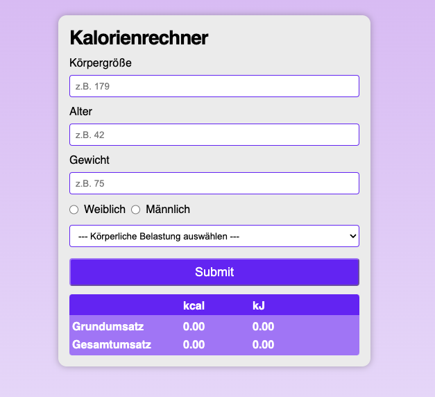

# Projekt_Mehrwertsteuer-Rechner

Mit dieser einfache Webapplikation können Nutzer:innen intuitiv ihren täglichen Kalorienbedarf anhand von Geschlecht, Aktivitätsniveau, Größe, Alter und Gewicht bestimmen.

# Tech Stack

- HTML5
- SCSS
- JavaScript

# Demo-Link

https://yacineyldrm.github.io/Projekt_Kalorienrechner/

# Screenshot

